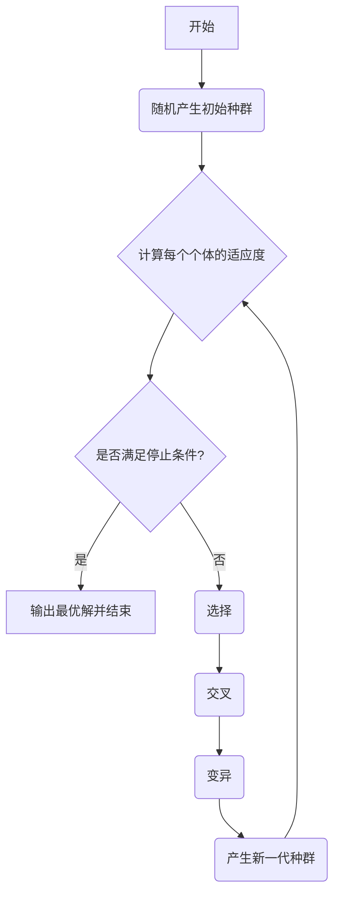

# 智能优化算法课程笔记

这一节包含**粒子群优化算法 (PSO)** 和 **遗传算法 (GA)**

---

### **目录**
- [智能优化算法课程笔记](#智能优化算法课程笔记)
    - [**目录**](#目录)
    - [**1. 什么是智能优化算法？**](#1-什么是智能优化算法)
      - [**与传统优化算法的区别**](#与传统优化算法的区别)
      - [**智能算法的共同特点**](#智能算法的共同特点)
    - [**2. 粒子群优化算法 (PSO) —— 模拟鸟群的智慧**](#2-粒子群优化算法-pso--模拟鸟群的智慧)
      - [**核心思想**](#核心思想)
      - [**算法的关键要素：位置与速度**](#算法的关键要素位置与速度)
      - [**PSO 算法步骤**](#pso-算法步骤)
    - [**3. 遗传算法 (GA) —— 模拟自然选择的力量**](#3-遗传算法-ga--模拟自然选择的力量)
      - [**核心思想**](#核心思想-1)
      - [**遗传算法的四大组成部分**](#遗传算法的四大组成部分)
        - [**A. 编码：如何描述一个个体？**](#a-编码如何描述一个个体)
        - [**B. 适应度函数：如何评价个体优劣？**](#b-适应度函数如何评价个体优劣)
        - [**C. 遗传算子：进化的三大法宝**](#c-遗传算子进化的三大法宝)
        - [**D. 运行参数：如何控制进化过程？**](#d-运行参数如何控制进化过程)
      - [**遗传算法完整流程**](#遗传算法完整流程)

---

### **1. 什么是智能优化算法？**

智能优化算法是一类模拟自然界中生物群体行为或物理过程的随机化搜索算法。它们为解决那些传统优化算法难以处理的复杂问题（如目标函数不可导、非线性、多峰等）提供了强大的工具。

#### **与传统优化算法的区别**

| 特征 | 传统优化算法 | 智能优化算法 |
| :--- | :--- | :--- |
| **搜索方式** | 从单个初始解出发，沿着一个确定的“改进方向”搜索。 | 从一个解的“群体”出发，通过群体中个体间的协作与竞争进行探索。 |
| **跳出局部最优** | 容易陷入局部最优解，因为只会向“更好”的方向移动。 | 通过概率性的探索和群体多样性，有更强的能力跳出局部最优，寻找全局最优解。 |
| **适用性** | 对目标函数和约束条件有较严格的要求（如连续、可微）。 | 对函数要求宽松，不依赖导数信息，适用范围更广。 |
| **计算重点** | 追求理论上的最优性。 | 更看重计算效率和能否在合理时间内给出一个足够好的解。 |

#### **智能算法的共同特点**
* **群体性**：通常不是对单个解进行操作，而是维护一个解的“种群”。
* **迭代性**：通过一次又一次的迭代，逐步优化整个种群，最终逼近最优解。
* **概率性**：搜索过程中包含随机因素，这使得它们能够探索整个解空间，具备全局优化能力。

一些著名的智能算法包括：
* **遗传算法 (Genetic Algorithms, GA)**
* **粒子群算法 (Particle Swarm Optimization, PSO)**
* **蚁群算法 (Ant Colony Optimization, ACO)**
* **模拟退火算法 (Simulated Annealing, SA)**
* **禁忌搜索算法 (Tabu Search, TS)**

### **2. 粒子群优化算法 (PSO) —— 模拟鸟群的智慧**

PSO算法由Kennedy和Eberhart在1995年提出，其灵感来源于对鸟群觅食行为的研究。

#### **核心思想**
想象一下，天空中有一群鸟在寻找食物，这片区域只有一个地方有食物。所有的鸟都不知道食物在哪里，但它们知道自己当前位置离食物有多远。那么，最有效的搜索策略是什么？就是**参考自己和其他鸟的经验**。

在PSO中，每一个潜在的解都被看作是搜索空间中的一只“**粒子**”（鸟）。
* 每个粒子都有自己的**位置**（代表一个解）和**速度**（决定了它下一步飞行的方向和距离）。
* 每个粒子都会记住自己历史上找到的“最好位置”，我们称之为**个体极值 (pBest)**。
* 同时，整个鸟群（种群）中的所有粒子，会共享信息，知道当前整个群体找到的“最好位置”，我们称之为**全局极值 (gBest)**。

在每一次迭代中，每个粒子都会根据自己的`pBest`和整个群体的`gBest`来调整自己的速度和位置，从而向更好的区域移动。

#### **算法的关键要素：位置与速度**

假设我们在一个 `D` 维空间中搜索，粒子总数为 `n`。对于第 `i` 个粒子：
* 它的位置是：$X_i = (x_{i1}, x_{i2}, ..., x_{iD})$
* 它的速度是：$V_i = (v_{i1}, v_{i2}, ..., v_{iD})$
* 它的个体最好位置是：$P_i = (p_{i1}, p_{i2}, ..., p_{iD})$
* 群体的全局最好位置是：$P_g = (p_{g1}, p_{g2}, ..., p_{gD})$

粒子在下一次迭代（`t+1`）的速度和位置更新公式如下：

**1. 更新速度：**
$$
v_{id}(t+1) = \underbrace{w \times v_{id}(t)}_{\text{惯性部分}} + \underbrace{c_1 \times rand() \times [p_{id}(t) - x_{id}(t)]}_{\text{认知部分}} + \underbrace{c_2 \times rand() \times [p_{gd}(t) - x_{id}(t)]}_{\text{社会部分}}
$$
这个公式非常直观：
* **惯性部分**：粒子保持自己原有速度的趋势。`w` 是惯性因子，`w`大则全局探索能力强，`w`小则局部开发能力强。
* **认知部分**：“思考”自己飞过的最好位置。这是粒子对自己经验的学习。`c1`是加速因子。
* **社会部分**：“学习”群体中其他粒子的最好经验。这是粒子间的协作。`c2`也是加速因子。

**2. 更新位置：**
$$
x_{id}(t+1) = x_{id}(t) + v_{id}(t+1)
$$
就是简单地根据新的速度，移动到新的位置。

#### **PSO 算法步骤**
1.  **初始化**：随机生成一群粒子（确定它们的初始位置和速度）。
2.  **评价**：计算每个粒子的适应度值（即解的好坏）。
3.  **更新pBest和gBest**：
    * 对于每个粒子，如果当前位置比它自己的历史最好位置 (`pBest`) 还要好，就更新`pBest`。
    * 在所有`pBest`中，找到最好的一个，如果它比当前的`gBest`还好，就更新`gBest`。
4.  **更新速度和位置**：使用上面的两个公式，为每个粒子计算新的速度和位置。
5.  **循环**：如果未满足停止条件（如达到最大迭代次数或解的精度要求），则返回第2步，否则结束。
6.  **输出**：将最终的`gBest`作为问题的最优解。

### **3. 遗传算法 (GA) —— 模拟自然选择的力量**

遗传算法由J. Holland于1975年提出，是智能计算领域影响最深远的算法之一。它借鉴了生物界的“优胜劣汰，适者生存”的进化法则。

#### **核心思想**
GA模拟了自然选择和遗传的过程。它将问题的潜在解看作是生物种群中的“**个体**”或“**染色体**”，并将求解过程看作是种群的演化过程。一个好的解，就像一个适应环境的个体，它有更大的机会生存下来并繁衍后代。通过一代又一代的**选择、交叉、变异**，种群的整体适应度会越来越高，最终进化出适应环境的个体，即问题的最优解。

#### **遗传算法的四大组成部分**

##### **A. 编码：如何描述一个个体？**
要用算法处理问题，首先要把问题的解“翻译”成算法能理解的语言。这个翻译过程就是**编码**。
* 在GA中，一个解被称为**个体 (Individual)**，它的编码表示形式叫做**染色体 (Chromosome)**。
* 染色体由一系列**基因 (Gene)** 组成。
* 最简单的编码方式是**二进制编码**，即用一串0和1来表示一个解。

**【编码示例】**
假设我们要在一个一元函数 $f(x)=x\cdot \sin(10\pi\cdot x)+1.0$ 中找最大值, 其中 $x \in [-1, 2]$，且要求精度为6位小数。

1.  **确定编码长度**：
    * 区间长度为 $2 - (-1) = 3$。
    * 要达到6位小数的精度，需要将区间划分为 $3 \times 10^6$ 份。
    * 我们需要找到一个二进制位数 `L`，使得 $2^L \ge 3 \times 10^6$。
    * 因为 $2^{21} < 3 \times 10^6 < 2^{22}$，所以我们至少需要22位二进制编码。

2.  **编码与解码**：
    * 一个22位的二进制串 $(b_{21}b_{20}...b_0)$ 首先可以转换成一个十进制整数 $x' = \sum_{i=0}^{21} b_i \cdot 2^i$。这个 $x'$ 的范围是 $[0, 2^{22}-1]$。
    * 然后，通过线性映射，将这个整数 $x'$ 转换回 $[-1, 2]$ 区间内的实数 $x$：
        $$
        x = -1.0 + \frac{x'}{2^{22}-1} \times 3
        $$
    * 这样，我们就建立了二进制串（**基因型**）和实际解（**表现型**）之间的对应关系。

##### **B. 适应度函数：如何评价个体优劣？**
适应度函数是用来衡量一个个体（解）好坏的唯一标准，它是GA进化过程的驱动力。**适应度越高的个体，越有可能被遗传到下一代**。
* 对于求最大值问题，可以直接将目标函数作为适应度函数。
* 对于求最小值问题，则需要对目标函数进行转换，例如取其倒数或用一个大数减去它。

##### **C. 遗传算子：进化的三大法宝**

**1. 选择 (Selection)**
选择操作模拟“优胜劣汰”。其核心思想是，适应度高的个体有更高的概率被选中，从而将其优良基因遗传给下一代。

* **轮盘赌选择法 (Roulette Wheel Selection)** 是最经典的选择方法。
    * **思想**：每个个体被选中的概率与其适应度成正比。
    * **步骤**：
        1.  计算种群中所有个体的总适应度 $\sum f(x_j)$。
        2.  计算每个个体 $x_i$ 的选择概率 $P(x_i) = \frac{f(x_i)}{\sum f(x_j)}$。
        3.  想象一个轮盘，每个个体根据其选择概率占据轮盘上的一块扇形区域。
        4.  转动轮盘，指针停在哪个区域，就选择对应的个体。重复N次（N为种群大小），就完成了新一代的选择。

**2. 交叉 (Crossover)**
交叉是GA产生新个体的主要方式，它模拟了生物的繁殖过程。
* **思想**：从种群中随机选择两个个体作为“父母”，以一定的**交叉概率 (Pc)**，将它们的染色体部分进行交换，从而产生两个新的“孩子”个体。
* **单点交叉**：在染色体上随机选一个交叉点，然后交换这一点之后的所有基因。
    ```
    父1: 11001 | 011    ->    子1: 11001 | 101
    父2: 01011 | 101    ->    子2: 01011 | 011
    ```

**3. 变异 (Mutation)**
变异为算法提供了跳出局部最优的可能性，并维持了种群的多样性。
* **思想**：以一个很小的**变异概率 (Pm)**，随机地改变染色体上的某个基因。
* **基本位变异**：对于二进制编码，就是将 `0` 变成 `1`，或将 `1` 变成 `0`。
    ```
    变异前: 11001011
    变异后: 11011011
               ^
    ```

##### **D. 运行参数：如何控制进化过程？**
* **种群规模 (M)**：种群中个体的数量。太小容易早熟，太大计算量大。
* **终止代数 (T)**：最大进化代数。
* **交叉概率 (Pc)**：发生交叉的概率。通常取值较大，如0.6-0.9。
* **变异概率 (Pm)**：发生变异的概率。通常取值很小，如0.001-0.01。

#### **遗传算法完整流程**

